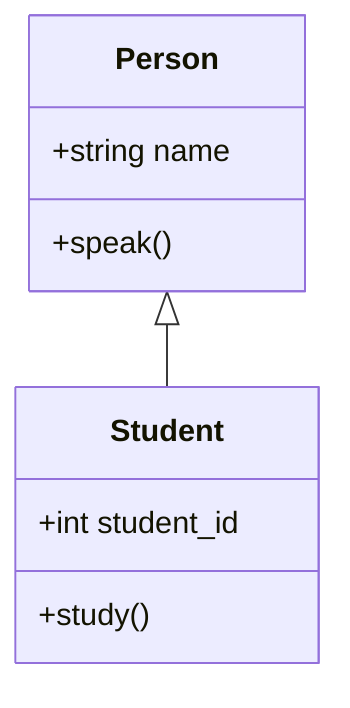
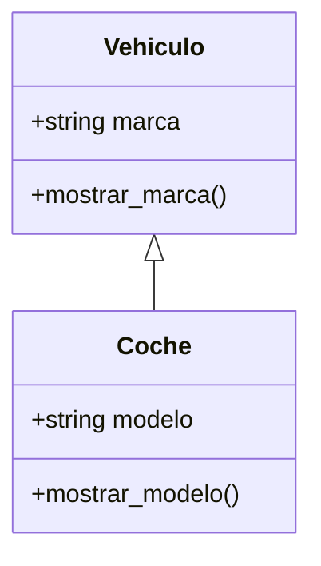
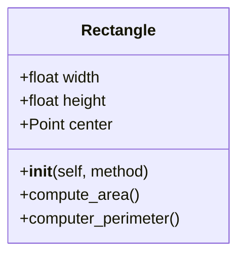

# Programación Orientada a Objetos - UNAL

## Clase 7: Herencia, cuando los objetos se parecen.

### Abstracción
La abstracción en POO implica destacar las **características esenciales** de un objeto, ignorando los detalles irrelevantes o accidentales. En Python, esto se logra mediante el uso de clases que definen los atributos y métodos esenciales de los objetos.

---------
### Herencia
La herencia en POO es un principio fundamental que permite a una clase heredar propiedades y métodos de otra clase. La clase de la cual se heredan las propiedades y métodos se conoce como clase base o *superclase*, y la clase que hereda es conocida como clase derivada o *subclase*. 

Pero entonces, cuál es la relación entre *heredar* y *que tan parecidos son los objetos*?

Simple, al *abstraer* podemos seguir definiendo clases que sean muy generales y que contengan todo lo común a algún objeto que se quiera modelar (de cierta manera agrupar lo esencial), y luego estas características comunes irlas cediendo a aquellas clases que tomen como modelo la clase base...*pretty nice, right?*...De modo que se puede decir que la herencia permite la abstracción.

#### ¿Por qué se usa la herencia?
 - **Reutilización de Código:** La herencia permite a las clases derivadas reutilizar el código de sus clases base sin tener que reescribirlo. Esto reduce la duplicación de código y facilita la mantenimiento (un poco como las funciones).
 - **Extensibilidad:** La herencia hace que sea fácil extender las funcionalidades de las clases base agregando nuevas funcionalidades en las clases derivadas.
 - **Abstracción:** La herencia proporciona una manera de crear una estructura jerárquica de clases que refleja las relaciones is-a (es-un) entre objetos, lo que ayuda a abstraer y modelar problemas complejos de manera más natural.



```python
class Person:
    specie: str = "Homo Sapiens"
    def __init__(self, name):
        self.name = name
    
    def speak(self):
        print("Hi!")

class Student(Person):
    def __init__(self, name, student_id):
        self.name = name
        self.student_id = student_id
    
    def study(self):
        print("Stu-dying :v")
```

```python
person = Person(name="Felix")
student = Student(name="John", student_id="123")

print(person.name)
person.speak()

print(student.specie, student.name)
student.speak()
```

#### `super`
`super` se utiliza en la herencia para referirse a la clase base, permitiendo llamar a sus métodos, pero especialmente el inicializador desde la clase derivada o hijo.

```python
class Person:
    specie: str = "Homo Sapiens"
    def __init__(self, name):
        self.name = name
    
    def speak(self):
        print("Hi!")

class Student(Person):
    def __init__(self, name, student_id):
        # Se llama la clase base y se instancia
        super().__init__(name)
        # y luego se agregan mas atributos
        self.student_id = student_id
    
    def study(self):
        print("Stu-dying :v")
```

```python
student = Student(name="John", student_id="123")

print(student.specie, student.name)
student.speak()
student.study()
```

Otro ejemplo:




```python
class Vehiculo:
    def __init__(self, marca):
        self.marca = marca

    def mostrar_marca(self):
        print(f"Marca del vehículo: {self.marca}")

class Coche(Vehiculo):
    def __init__(self, marca, modelo):
        super().__init__(marca)
        self.modelo = modelo

    def mostrar_modelo(self):
        print(f"Modelo del coche: {self.modelo}")

carro = Coche(marca="Mazda", modelo="2020")
carro.mostrar_marca()
carro.mostrar_modelo()
```

Una característica muy importante de la herencia es que define la relación *es un*, y como se ha visto previamente, también se puede tener la relación *tiene un/unos*. De momento dejemos la cuestión de *ser* y luego se evalúa la de *tener*.

### Herencia múltiple

La herencia múltiple en programación orientada a objetos (POO) ocurre cuando una clase deriva de más de una clase base. Esto permite que una subclase herede atributos y métodos de múltiples superclases, combinando sus funcionalidades. Aunque poderosa, la herencia múltiple debe usarse con precaución debido a la complejidad y posibles ambigüedades que introduce.

#### Casos de uso
 - **Combinación de Funcionalidades:** Cuando una subclase necesita combinar funcionalidades de varias superclases.
 - **Mixins:** Para añadir funcionalidades adicionales a una clase de manera modular. Los mixins son clases que no están destinadas a ser instanciadas solas sino a añadir funcionalidades a otras clases mediante herencia múltiple.
 - **Interfaces:** Implementar múltiples interfaces en lenguajes que usan clases para definir interfaces.

 **Ejemplo:**

 ```mermaid
classDiagram
    class EmailSender {
      +send_email(message)
    }
    class SMSSender {
      +send_sms(message)
    }
    EmailSender <|-- NotificationManager
    SMSSender <|-- NotificationManager
    class NotificationManager {
    }
```

```python
class EmailSender:
    def send_email(self, message):
        print(f"Sending email: {message}")

class SMSSender:
    def send_sms(self, message):
        print(f"Sending SMS: {message}")

class NotificationManager(EmailSender, SMSSender):
    pass

manager = NotificationManager():
manager.EmailSender()
manager.SMSSender()
```

#### Problemas
**Problema del Diamante:** Cuando dos superclases derivan de una clase base común, y una subclase hereda de ambas, puede haber ambigüedad en la ruta de herencia, especialmente en cómo se inicializan las superclases y en qué orden se llaman los métodos.

 ```mermaid
classDiagram
    Base <|-- A
    Base <|-- B
    A <|-- C
    B <|-- C
    class Base {
      +__init__()
    }
    class A {
      +__init__()
    }
    class B {
      +__init__()
    }
    class C {
      +__init__()
```

```python
class Base:
    def __init__(self):
        print("Base init")

class A(Base):
    def __init__(self):
        super().__init__()
        print("A init")

class B(Base):
    def __init__(self):
        super().__init__()
        print("B init")

class C(A, B):
    def __init__(self):
        super().__init__()
        print("C init")
```

**Ambigüedad en la Resolución de Métodos:** Si varias superclases definen el mismo método, puede ser ambiguo cuál método hereda la subclase.

**Ejercicio:**
1. Cree la clase Rectangle.

 - The rectangle should be inicialice using any of these 3 methods:
    + Method 1: Bottom-left corner(Point) + width and height
    + Method 2: Center(Point) + width and height
    + Method 3: Two opposite corners (Points) e.g. Bottom-left and Upper-right

 - *width*, *height*, center: Instance attributes
 - compute_area(): should return the area of the rectangle
 - compute_perimeter(): should return the perimeter of the rectangle

2. Create a class Square() that inherited the required attributes and methods from Rectangle.

3. Create a method called compute_interference_point(Point) that returns if a point is inside or a rectangle.

4. **Optional:** Define a method called compute_interference_line() that return if a line or part of it is inside of a rectangle.